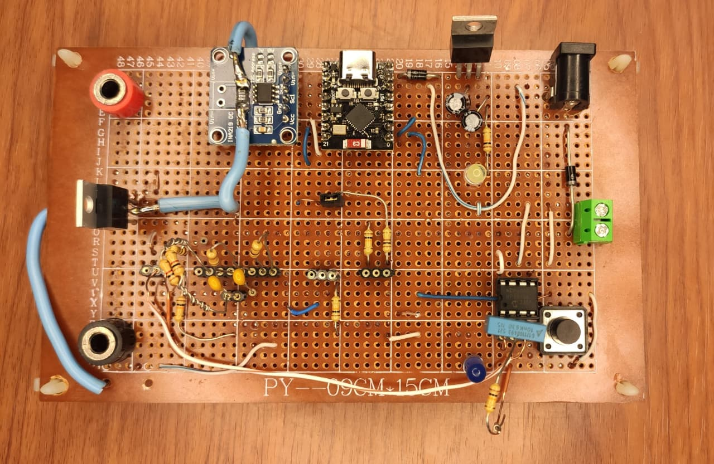
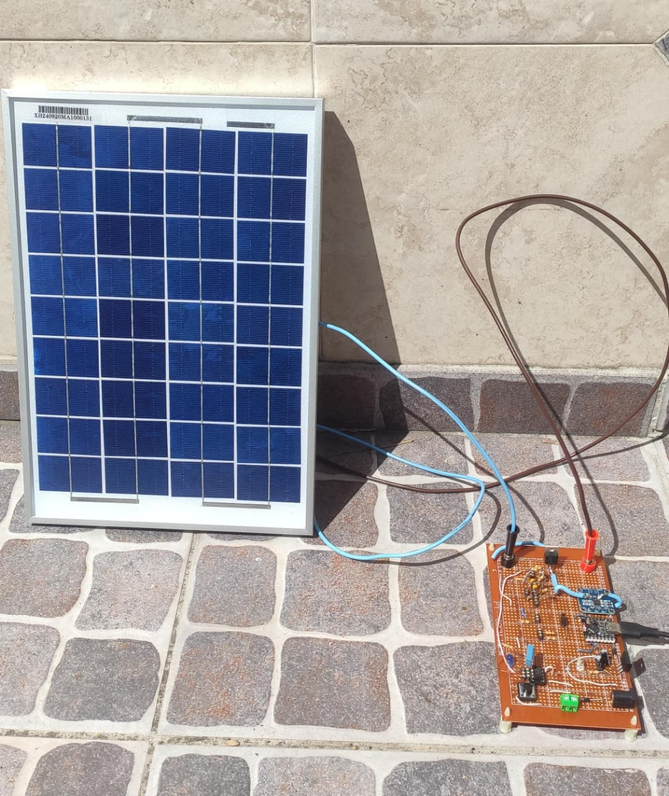
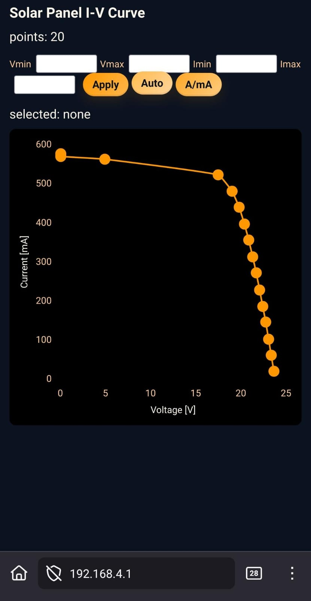

<h1 align="center">Solar Panel I-V Curve Tracer</h1>

An ESP32-C3 that traces the I-V curve of a small solar panel: it loads the panel with a
PWM-controlled electronic load (op-amp VCCS + MOSFET), measures voltage and current with an
INA219 sensor, and auto-ranges a 20-point sweep spread by arc length along the curve. Results are
served over the device's own Wi-Fi as a web UI (Chart.js), and a SH1106 OLED with a rotary
encoder gives a local menu.

<table align="center"><tr>
<td></td>
<td></td>
<td></td>
</tr></table>

## Quick start

1. Power on the device.
2. Join the Wi-Fi network `ESP32_PLOT` (no password).
3. Open `http://192.168.4.1` and press **Start**.

A printable, two-page A4 quick guide (Spanish + English) is at
[docs/quick_guide.pdf](docs/quick_guide.pdf); the same content is served on the device itself at
`http://192.168.4.1/guide`, and reachable from the OLED menu at **NETWORK > SHOW GUIDE QR**.

## Updating the firmware (OTA)

The whole app, including the web UI, is one file. To update:

1. While online, download `app-standard.bin` from the
   [latest release](https://github.com/fborello-lambda/solar_panel_curve_tracer/releases/latest).
2. Join the `ESP32_PLOT` Wi-Fi network.
3. Open `http://192.168.4.1/ota`, or scan the QR at OLED **SYSTEM > OTA**.
4. Pick the file, upload, and wait about 30 seconds for the reboot, then reconnect.

For a brand-new or blank board, flash `factory-standard.bin` over USB instead:

```sh
esptool.py --chip esp32c3 write_flash 0x0 factory-standard.bin
```

> [!IMPORTANT]
> Everyone uses the **standard** release. `app-secure-boot.bin` is only for the maintainer's
> single board that has Secure Boot burned into its eFuses; flashing it on another board would
> make that board accept only images signed with this project's key from then on.
>
> The Secure Boot signing key (`secure_boot_signing_key.pem`) is committed to this repo on
> purpose, since this board is used for experimentation and holds no secrets. Do not do this in
> a real deployment; see [LESSONS.md](LESSONS.md) for why.

## How the sweep works

Each trace auto-ranges: the firmware probes open-circuit voltage (Voc), then doubles the
commanded load current until the panel collapses, locating the knee of the curve without the
operator dialling in a current range. From there, an adaptive stepper places the 20 recorded
points by normalized arc length along the curve (voltage and current each scaled 0..1), so the
steep part near Voc, the knee, and the flat part near Isc all get points regardless of the
panel's actual Isc (a few mA up to the load's cap). At the Voc probe (duty 0, no load) the
current sensor's reading is pure error, proportional to the panel voltage (see
[LESSONS.md](LESSONS.md)); it is measured there and subtracted from every point, so readings match a
multimeter to about 1 mA.

## Build from source

```sh
idf.py set-target esp32c3   # first time only
idf.py build
idf.py flash monitor
```

Secure-boot variant (maintainer's board only):

```sh
idf.py -B build-secure -D SDKCONFIG=build-secure/sdkconfig \
    -D SDKCONFIG_DEFAULTS="sdkconfig.defaults;sdkconfig.secure" build
./secure_boot_flash.sh
```

Host unit tests (pure sweep math and JSON serialiser, no hardware needed):

```sh
cd test/host
idf.py --preview set-target linux
idf.py build
./build/host_tests.elf
```

See [AGENTS.md](AGENTS.md) for the full repository layout, endpoint list, and developer details.
A VS Code + ESP-IDF extension setup is available via `cp .vscode/settings.json.example
.vscode/settings.json`.

## Hardware

See [AGENTS.md](AGENTS.md#hardware-pinout) for the GPIO pinout and I2C addresses. The solar panel
used for testing is a Luxen 10 W 12 V LN-10P.

A prototype PCB was hand-mounted on a perfboard; see [LESSONS.md](LESSONS.md) for hardware
lessons learnt (missing ground connections, thermal layout, mirrored footprints, and more).

## References

<details>
<summary>Papers, datasheets, and background reading</summary>

- Rashid, M.H. (2013) Power Electronics: Devices, Circuits, and Applications. 4th Edition, Pearson Education, Harlow. Chapter 16, Introduction to Renewable Energy.
- [Practical Guide to Implementing Solar Panel MPPT Algorithms](https://ww1.microchip.com/downloads/en/appnotes/00001521a.pdf)
- [Modeling Photovoltaic Cells, Theory 1/2 (YouTube)](https://www.youtube.com/watch?v=uV_z1ptufa4)
- [Modeling Photovoltaic Cells, LTspice model 2/2 (YouTube)](https://www.youtube.com/watch?v=ox0UtYe4owI)
- [INA219 datasheet (Rev. G)](https://www.ti.com/lit/ds/symlink/ina219.pdf)
- [Using An Op Amp for High-Side Current Sensing (Rev. A)](https://www.ti.com/lit/ab/sboa347a/sboa347a.pdf)
- [High voltage adjustable constant current source controlled by MCU (EE Stack Exchange)](https://electronics.stackexchange.com/questions/591912/high-voltage-adjustable-constant-current-source-controlled-by-mcu)
- [An Easy Solution to Current Limiting an Op Amp](https://www.ti.com/lit/an/sbva011/sbva011.pdf)
- [Implementation and Applications of Current Sources and Current Receivers](https://www.ti.com/lit/an/sboa046/sboa046.pdf)
- [MOSFET, OPAMP circuit (EE Stack Exchange)](https://electronics.stackexchange.com/questions/57448/mosfet-opamp-circuit)
- [Driving an IRLZ44N Logic MOSFET with a 2N2222 NPN Transistor from an ESP32 (EE Stack Exchange)](https://electronics.stackexchange.com/questions/751783/driving-an-irlz44n-logic-mosfet-with-a-2n2222-npn-transistor-from-an-esp32)
- [Micro-controller controlled current source (EE Stack Exchange)](https://electronics.stackexchange.com/questions/56772/micro-controller-controlled-current-source)
- [Unstable Feedback in Opamp+MOSFET circuit for Voltage Controlled Current Source (EE Stack Exchange)](https://electronics.stackexchange.com/questions/180175/unstable-feedback-in-opampmosfet-circuit-for-voltage-controlled-current-source)
- [Power MOSFET gate driver fundamentals](https://assets.nexperia.com/documents/application-note/AN90059.pdf)
- [PWM DAC (Rev. A)](https://www.ti.com/lit/sd/slaaec5a/slaaec5a.pdf)
- [Using PWM Output as a Digital-to-Analog Converter on a TMS320F280x (Rev. A)](https://www.ti.com/lit/an/spraa88a/spraa88a.pdf)
- [Using PWM Timer_B as a DAC (Rev. A)](https://www.ti.com/lit/an/slaa116a/slaa116a.pdf)
- [Dual-Output 8-Bit PWM DAC Using Low-Memory MSP430 MCUs](https://www.ti.com/lit/ab/slaa804/slaa804.pdf)

</details>
