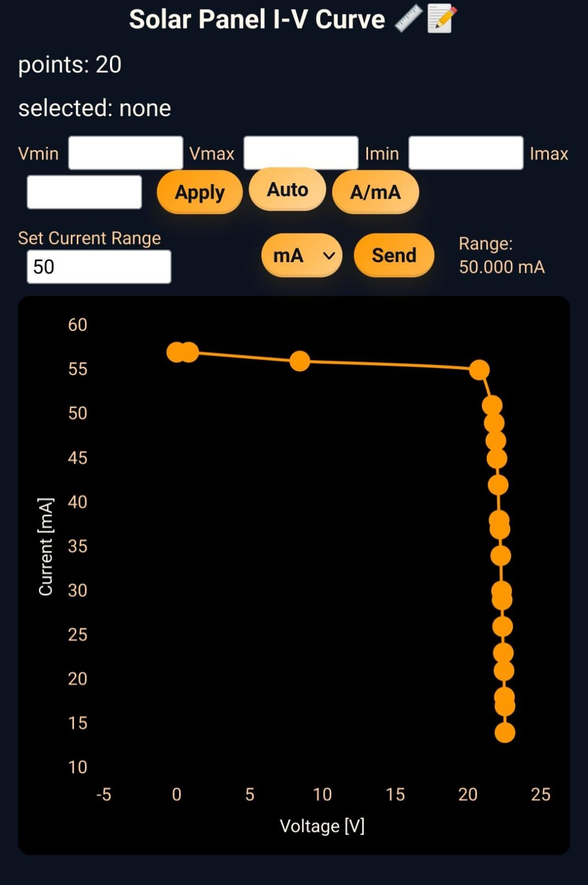

<h1 align="center">Solar Panel I-V Curve Tracer</h1>

>[!NOTE]
> The project was built on top of the template project provided by ESP-IDF. The example is used by command `idf.py create-project`
that copies the project to user specified path and set it's name. For more information follow the [docs page](https://docs.espressif.com/projects/esp-idf/en/latest/api-guides/build-system.html#start-a-new-project)

## How

The project was developed with the VSCode IDE using the ESP-IDF extension. The project can be built and flashed to the ESP32-C3 using the ESP-IDF tools. The web server can be accessed by connecting to the ESP32-C3's Wi-Fi network and navigating to the IP address of the ESP32-C3 in a web browser.

A good starting point is:

Copy the settings file for VSCode to enable ESP-IDF extension features:

```sh
cp .vscode/settings.json.example .vscode/settings.json
```

Then choose the `esp32c3` target by clicking on the target in the bottom bar of VSCode, or by pressing Ctrl+Shift+P and typing `ESP-IDF: Set Espressif device target`.

By doing this, the ESP-IDF extension will use the correct toolchain and settings for the ESP32-C3.

To connect to the ESP32-C3's Wi-Fi network, the default SSID is `"ESP32_PLOT"` with no password. Then navigate to `http://192.168.4.1` in a web browser and the web interface should load. The `/data` endpoint is used to fetch the data for the chart, it returns a JSON object with the voltage and current data as a list of x,y points.

## What

The Circuit is based on an ESP32-C3 microcontroller, INA219 current sensor, and an op-amp based voltage controlled current source (VCCS) to load the solar panel. The ESP32-C3 reads the voltage and current from the solar panel using the INA219 sensor, and adjusts the load using PWM to control the VCCS. The data is then sent to a web server hosted on the ESP32-C3, where it can be visualized in real-time.

A prototype PCB was mounted on a perfboard, and the firmware was developed using ESP-IDF. The web interface is built using HTML, CSS, and JavaScript, and uses the Chart.js library for data visualization. For more information about the circuit design and implementation, please refer to the [notebook](notebook/README.md).

### Prototype PCB

<div align="center">
    
</div>

### Measurement setup

<div align="center">
    
</div>

### Web interface

<div align="center">
    
    
</div>

The solar panel used is a Luxen 10W 12V panel. LN-10P

## References

- Rashid, M.H. (2013) Power Electronics: Devices, Circuits, and Applications. 4th Edition, Pearson Education, Harlow. Chapter 16 - Introduction to Renewable Energy.
- [Practical Guide to Implementing Solar Panel MPPT Algorithms - 00001521a.pdf](https://ww1.microchip.com/downloads/en/appnotes/00001521a.pdf)
- [Modeling Photovoltaic Cells - Theory 1/2 - YouTube](https://www.youtube.com/watch?v=uV_z1ptufa4)
- [Modeling Photovoltaic Cells - LTspice model part 2/2 - YouTube](https://www.youtube.com/watch?v=ox0UtYe4owI)
- [INA219 Zerø-Drift, Bidirectional Current/Power Monitor With I2C Interface datasheet (Rev. G) - ina219.pdf](https://www.ti.com/lit/ds/symlink/ina219.pdf)
- [Using An Op Amp for High-Side Current Sensing (Rev. A) - sboa347a.pdf](https://www.ti.com/lit/ab/sboa347a/sboa347a.pdf?ts=1755743557072)
- [operational amplifier - High voltage adjustable constant current source controlled by MCU - Electrical Engineering Stack Exchange](https://electronics.stackexchange.com/questions/591912/high-voltage-adjustable-constant-current-source-controlled-by-mcu)
- [An\_Easy\_Solution\_to\_Current\_Limiting\_an\_Op\_Amp - sbva011.pdf](https://www.ti.com/lit/an/sbva011/sbva011.pdf?ts=1755718060450&ref_url=https%253A%252F%252Fwww.bing.com%252F)
- [Implementation\_and\_Applications\_of\_Current\_Sources\_and\_Current\_Receivers\ - sboa046.pdf](https://www.ti.com/lit/an/sboa046/sboa046.pdf?ts=1755759450978&ref_url=https%253A%252F%252Fwww.google.com%252F)
- [operational amplifier - MOSFET - OPAMP circuit - Electrical Engineering Stack Exchange](https://electronics.stackexchange.com/questions/57448/mosfet-opamp-circuit)
- [voltage - Driving an IRLZ44N Logic MOSFET with a 2N2222 NPN Transistor from an ESP32 - Electrical Engineering Stack Exchange](https://electronics.stackexchange.com/questions/751783/driving-an-irlz44n-logic-mosfet-with-a-2n2222-npn-transistor-from-an-esp32)
- [microcontroller - Micro-controller controlled current source - Electrical Engineering Stack Exchange](https://electronics.stackexchange.com/questions/56772/micro-controller-controlled-current-source)
- [Unstable Feedback in Opamp+MOSFET circuit for Voltage Controlled Current Source - Electrical Engineering Stack Exchange](https://electronics.stackexchange.com/questions/180175/unstable-feedback-in-opampmosfet-circuit-for-voltage-controlled-current-source)
- [Power MOSFET gate driver fundamentals - AN90059.pdf](https://assets.nexperia.com/documents/application-note/AN90059.pdf)
- [PWM DAC (Rev. A) - slaaec5a.pdf](https://www.ti.com/lit/sd/slaaec5a/slaaec5a.pdf?ts=1756837124081)
- [Using PWM Output as a Digital-to-Analog Converter on a TMS320F280x (Rev. A) - spraa88a.pdf](https://www.ti.com/lit/an/spraa88a/spraa88a.pdf?ts=1756204084617)
- [Using PWM Timer\_B as a DAC (Rev. A) - slaa116a.pdf](https://www.ti.com/lit/an/slaa116a/slaa116a.pdf?ts=1756222437207&ref_url=https%253A%252F%252Fwww.google.com%252F)
- [Dual-Output 8-Bit PWM DAC Using Low-Memory MSP430™ MCUs - slaa804.pdf](https://www.ti.com/lit/ab/slaa804/slaa804.pdf?ts=1756207779110&ref_url=https%253A%252F%252Fwww.ti.com%252Ftool%252FMSP-EXP430FR2311)
