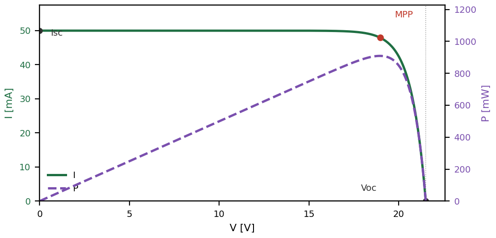

# Guía rápida (Español)

## Qué hace

Este dispositivo mide y traza la curva I-V (corriente vs. tensión) de un
panel solar pequeño, calculando el punto de máxima potencia (MPP).

## Seguridad

- El MOSFET de carga se calienta durante el barrido: es normal.
- El barrido se detiene automáticamente si la potencia llega a 5 W.
- La carga está limitada a unos 780 mA (20% de la escala completa).
- Este prototipo no tiene interruptor de encendido: desconecte la batería
  para apagarlo.

## Conectar el panel

- Conecte el terminal positivo del panel a **PV+**.
- Conecte el terminal negativo del panel a **PV-**.

## Encendido

- Conecte la batería. El dispositivo arranca solo y muestra el menú en la
  pantalla OLED.

## Medir desde la pantalla OLED

1. Gire el encoder para ir a **MEASURE**, presione para entrar.
2. Seleccione **CURVE TRACER**, presione para entrar.
3. Seleccione **START TRACE** y presione para iniciar el barrido.
4. Girar mueve la selección; presionar confirma.

## Medir desde un teléfono o laptop

1. Conéctese a la red Wi-Fi **ESP32_PLOT** (sin contraseña).
2. Abra `http://192.168.4.1` en el navegador.
3. Presione **Start Measurement**.

## Qué sucede durante un barrido

1. Se mide la tensión de circuito abierto (Voc).
2. Se busca automáticamente el rango de corriente adecuado.
3. Se registran 20 puntos, la mayoría concentrados cerca del codo de
   la curva.
4. El barrido completo toma entre 10 y 15 segundos.

## Leer el resultado

- **Voc**: tensión de circuito abierto.
- **Isc**: corriente de cortocircuito.
- **MPP**: punto de máxima potencia (tensión y corriente).
- La forma general de la curva indica el estado del panel.
- Isc típica aprox. 50 mA, por lo que las lecturas resuelven en pasos de
  aprox. 1 mA.

{width=32%}

## Consejos

- Mantenga la iluminación estable durante el barrido.
- No mueva ni tape el panel mientras mide.
- El parpadeo de lámparas se promedia automáticamente, no afecta la medida.

## Solución de problemas

| Problema | Causa probable |
|---|---|
| No se registran puntos | Voc < 0.5 V: panel desconectado u oscuridad |
| La curva no llega a 0 V | El panel supera el límite de carga del 20% |
| El barrido se detiene antes | Se alcanzó el límite de seguridad de 5 W |
| La página web está vacía | Reconéctese a la red Wi-Fi ESP32_PLOT |

## Modo de bajo consumo

El dispositivo despierta al presionar el botón del encoder.

\newpage

# Quick Guide (English)

## What it does

This device measures and traces the I-V curve (current vs. voltage) of a
small solar panel, computing the maximum power point (MPP).

## Safety

- The load MOSFET heats up during a sweep: this is normal.
- The sweep aborts automatically if power reaches 5 W.
- The load is capped at about 780 mA (20% of full scale).
- This prototype has no power switch: unplug the battery to turn it off.

## Connecting the panel

- Connect the panel's positive lead to **PV+**.
- Connect the panel's negative lead to **PV-**.

## Powering on

- Connect the battery. The device boots on its own and shows the menu on
  the OLED screen.

## Measuring from the OLED

1. Turn the encoder to **MEASURE**, press to select.
2. Select **CURVE TRACER**, press to enter.
3. Select **START TRACE** and press to begin the sweep.
4. Turning navigates; pressing selects.

## Measuring from a phone or laptop

1. Connect to Wi-Fi network **ESP32_PLOT** (no password).
2. Open `http://192.168.4.1` in a browser.
3. Press **Start Measurement**.

## What happens during a sweep

1. Open-circuit voltage (Voc) is measured.
2. The current range is found automatically.
3. 20 points are recorded, most clustered near the knee of the curve.
4. A full sweep takes about 10 to 15 seconds.

## Reading the result

- **Voc**: open-circuit voltage.
- **Isc**: short-circuit current.
- **MPP**: maximum power point (voltage and current).
- Overall curve shape indicates the panel's condition.
- Typical Isc is about 50 mA, so readings resolve to about 1 mA steps.

{width=32%}

## Tips

- Keep lighting steady during the sweep.
- Do not move or shade the panel while measuring.
- Flickering lamps are averaged out automatically; no need to worry.

## Troubleshooting

| Problem | Likely cause |
|---|---|
| No points recorded | Voc < 0.5 V: panel disconnected or dark |
| Curve does not reach 0 V | Panel is stronger than the 20% load cap |
| Sweep stopped early | Hit the 5 W safety limit |
| Web page is empty | Reconnect to the ESP32_PLOT Wi-Fi network |

## Deep sleep

The device wakes up with a press of the encoder button.
